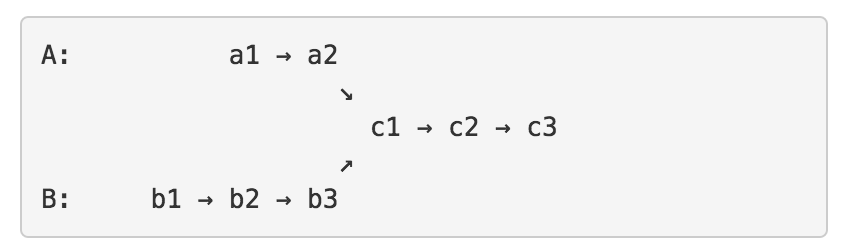

# 1. Linked List Cycle
Linked List Cycle

Given a linked list, determine if it has a cycle in it.
http://www.lintcode.com/en/problem/linked-list-cycle/


TC: O(n)

快慢指针判断，slow每次走一步， fast每次走两步， 如果是circle，fast一定撞上slow,并且此时fast超了slow一圈.


```java
    public boolean hasCycle(ListNode head) {  
        if (head == null || head.next == null) {
            return false;
        }
        
        // fast and slow listnodes
        ListNode fast = head;
        ListNode slow = head;
        
        //Determine if fast can move two steps
        while (fast.next != null && fast.next.next != null) {
            slow = slow.next;
            fast = fast.next.next;
            if (fast == slow) {
                return true;
            }
        }
        return false;
    }
```

Follow Up:

**环的长度是多少？
**

设：链表头是X，环的第一个节点是Y，slow和fast第一次的交点是Z。各段的长度分别是a,b,c，如图所示。环的长度是L。slow和fast的速度分别是qs,qf。

第一次相遇后，让fast停着不走了，slow继续走，记录到下次相遇时循环了几次。

**如何找到环中第一个节点（即Linked List Cycle II）？
**

http://www.lintcode.com/en/problem/linked-list-cycle-ii/


设：链表头是X，环的第一个节点是Y，slow和fast第一次的交点是Z。各段的长度分别是a,b,c，如图所示。环的长度是L。slow和fast的速度分别是qs,qf。

第一次相遇时slow走过的距离：a+b，fast走过的距离：a+b+c+b。

因为fast的速度是slow的两倍，所以fast走的距离是slow的两倍，有 2(a+b) = a+b+c+b，可以得到
# **a=c**

（这个结论很重要！）。

TC: O(n)

那么让两个指针分别从X和Z开始走，每次走一步，那么正好会在Y相遇！也就是环的第一个节点。

```java
    public ListNode detectCycle(ListNode head) {  
        //快慢指针相遇时候， 一个指针从头走，一个指针从相遇点走，再相遇就是节点
        if (head == null) return null;
        
        ListNode slow = head;
        ListNode fast = head;
        while (fast.next != null && fast.next.next != null) {
            slow = slow.next;
            fast = fast.next.next;
            //此时相遇
            if (fast == slow) {
                slow = head;
                while (fast != slow) {
                fast = fast.next;
                slow = slow.next;
                }
                return slow;
            }
        }
        
        return null;
    }
```

**如何将有环的链表变成单链表（解除环）？
**

在上一个问题的最后，将c段中Y点之前的那个节点与Y的链接切断即可。

**如何判断两个单链表是否有交点？如何找到第一个相交的节点？
**

 Intersection of Two Linked Lists

http://www.lintcode.com/en/problem/intersection-of-two-linked-lists/


这题需要得到两个链表的交接点，也就是c1，这一题也很简单。

遍历A，到结尾之后，将A最后的节点连接到B的开头，也就是c3 -> b1

使用两个指针fast和slow，从a1开始，判断是否有环

如果没环，在返回之前记得将c3 -> b1给断开

如果有环，则按照第二题的解法得到c1，然后断开c3 -> b1


```java
public ListNode getIntersectionNode(ListNode headA, ListNode headB) {
        // Write your code here
        if (headA == null || headB == null) return null;
        if (headA == headB) return headA;
        ListNode start = headA;
        
        //遍历A
        while (start.next != null) {
            start = start.next;
        }
        
        //A和B接上
        start.next = headB;
        
        //快慢指针判断有没有环
        ListNode fast = headA;
        ListNode slow = headA;
        
        while (fast.next != null && fast.next.next != null) {
            slow = slow.next;
            fast = fast.next.next;
            if (slow == fast) {
                slow = headA;
                while (slow != fast) {
                    slow = slow.next;
                    fast = fast.next;
                }
                //找到了 A和B断开
                start.next = null;
                return slow;
            }
        }
        //不是环 A和B断开
        start.next = null;
        return null;
    } 
```
