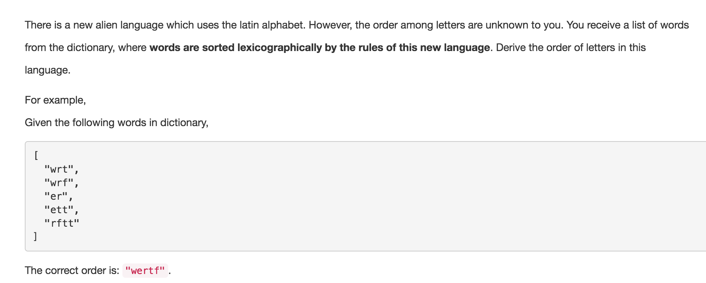

# Alien Dictionary


* 同一个单词中的字母先后顺序没有任何意义；
* 相邻单词之间，按照 Lexicographical order 排列的意义是，双方字符串中第一个不 match 的字符代表这一条 directed edge，即字符的先后顺序；
* 如果发现字典 Graph 中有环，返回空字符串；
* 加入新入度的时候，记得查重，不要重复加入度

```java
public class Solution {
    //flag 用于判断edge case: wabb wa,这种非法情况 return ""
    boolean flag;
    
    public String alienOrder(String[] words) {
        if (words == null) return "";
        
        Map<Character, Set<Character>> graph = new HashMap<>();
        Map<Character, Integer> indegree = new HashMap<>();
        
        //构造图和入度
        createGraphIndegree(words, graph, indegree);
        if (flag == true) return "";
        
        StringBuilder order = new StringBuilder();
        //拓扑排序
        topoSort(order, graph, indegree);
        
        //如果有环存在，某一入度永远不为0,就加不进结果，导致结果的length < 应该有的length
        if (order.length() != indegree.size()) return "";
        return order.toString();
    }
    
    private void createGraphIndegree(String[] words, Map<Character, Set<Character>> graph, Map<Character, Integer> indegree) {
        //initialize indegree
        for (String word: words) {
            for (char c: word.toCharArray()) {
                indegree.put(c, 0);
            }
        }
        
        for (int i = 0; i < words.length - 1; i++) {
            String first = words[i];
            String second = words[i + 1];
            int len = Math.min(first.length(), second.length());
            int j = 0;
            for(; j < len; j++) {
                char from = first.charAt(j);
                char to = second.charAt(j);
                if (from == to) continue;
                if (!graph.containsKey(from)) {
                    graph.put(from, new HashSet<>());
                } 
                
                //防止重复给同一条边加入度，实现的非常巧妙
                if (graph.get(from).add(to)) {
                    indegree.put(to, indegree.get(to) + 1);
                }
                //比完第一个不等的就break了
                break;
            }
            
            //单独判断： 前缀相等但第一个单词长于第二个单词
            if (j == len && first.length() > len) flag = true;
        }
    }
    
    private void topoSort(StringBuilder order, Map<Character, Set<Character>> graph, Map<Character, Integer> indegree) {
        Queue<Character> q = new LinkedList<>();
        for (char c: indegree.keySet()) {
            if (indegree.get(c) == 0) {
                q.offer(c);
            }
        }
        
        while (!q.isEmpty()) {
            char curr = q.poll();
            order.append(curr);
            Set<Character> neighbors = graph.get(curr);
            
            if (neighbors == null) continue;
            for (char neighbor: neighbors) {
                int newDegree = indegree.get(neighbor) - 1;
                
                if (newDegree == 0) q.offer(neighbor);
                indegree.put(neighbor, newDegree);
            }
        }
    }
}
```