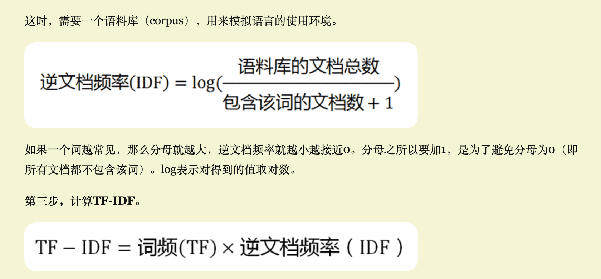

# Behavior Questions

| Common Questions | Newton | RunRecipe | KNN | Finanial |
| -- | -- | -- | -- | -- |
| Most Challenging | Positiven or Negative (Context, sentence, how many po words & negative words, very * 2, dramatically * 2) | Get real-time data from API(call every second, froze account, summary page) | Normalize values to become numeric (weight accordingly, adjust through cross validation) | Several people create funds or end transition day at the same time (Synchronized Methods) |
| What you learnt | API not good for machine learning (Different data sets have their own characteristics) | Adjust Solution based on API features | Adjust attributes to get ideal result | ensure ACID in transactions |
| Most Interesting | IBM API | call Fitbit API | Adjust weight value to improve correctness | Testing,several people click at the same time |
| Hardest Bug | Key-Terms | call Fitbit API | low cross validation rate initially | Several people click at the same time |
| Enjoy Most | real-time analysis, correct conclusion, judges were impressed  | use my own app to run and get fitness summary | get 92% cross validation rate | Testing |
| Conflicts with Teammates | Team management(Asana) | Did little and no communication. Had a talk and split work more in detail | Wanna do same work, list strength and experience, split work in small componenets, rank the first three, coordinate each person has their favor work to do | do little, he was sick, we had to cover his work, we are a team, we need to handle this kind of situation |

