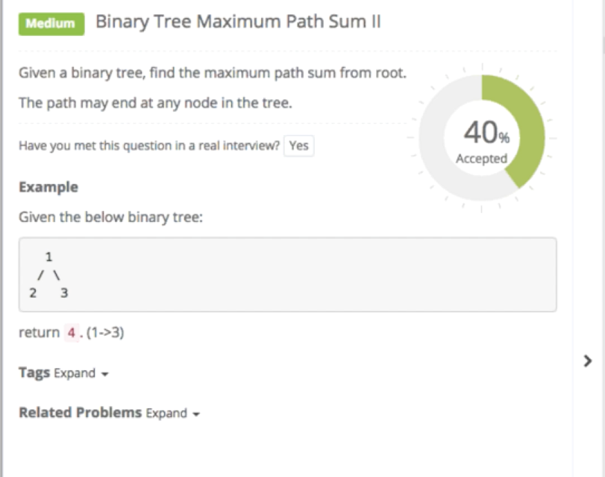
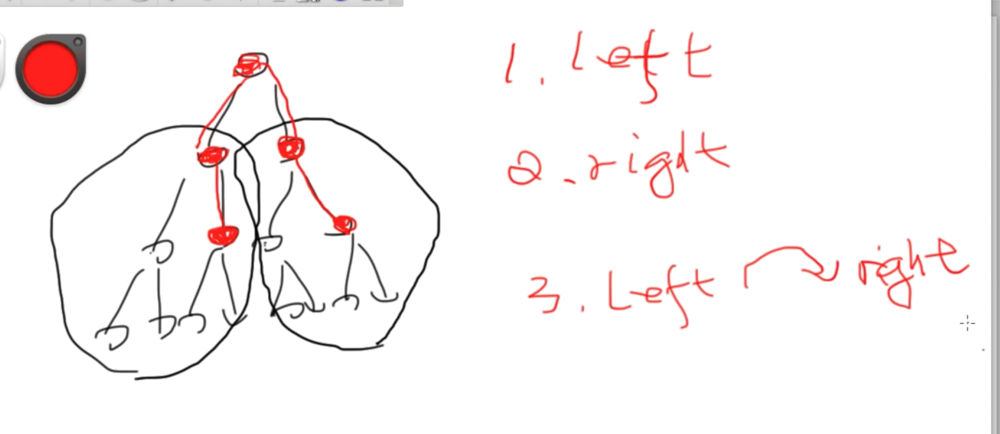
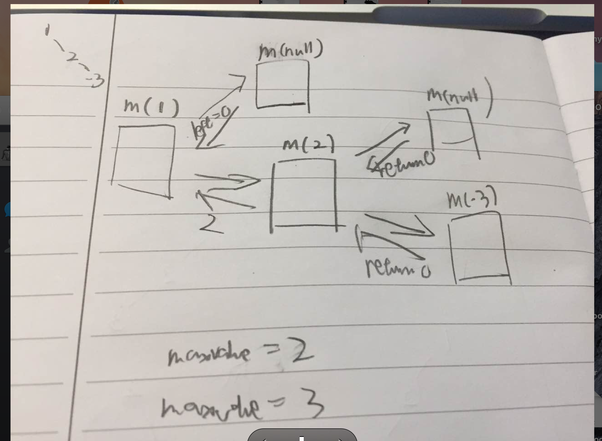

# Binary Tree Maximum Path Sum 简单 难

简单：root到某个节点的最大path

分治 左右子树的最大Path求出后，和0比一下， 最后再加上根



```java
    public int maxPathSum(TreeNode root) {
        if (root == null) {
            return Math.MIN_VALUE;
        }
        
        int left = maxPathSum(root.left);
        int right = maxPathSum(root.right);
        
        //如果不和0比，就是root到每个叶子节点的最长路径，因为左右子数可能<0，此时要砍掉，只输出root.val
        return Math.max(Math.max(left, right), 0) + root.val;
    }
```

难
any node to any node

http://www.lintcode.com/en/problem/binary-tree-maximum-path-sum/


分治
三种情况，左边最大，右边最大，左中右最大
用全局变量记录最大值。 用分治把左右两边最大值搞定**并和0比较**
然后给maxValue赋值

maxValue = Math.max(maxValue, left + right + node.val);

最后把左右子树最大值return

也可用max[]避免全局变量。就是一个存result的reference object，java不支持c++那种直接&传reference

    int[] max = new int[1];


```java
//维护一个全局变量
int maxValue;
    
    public int maxPathSum(TreeNode root) {
        // write your code here
        if (root == null) return Integer.MIN_VALUE;
        maxValue = Integer.MIN_VALUE;
        maxPathDown(root);
        return maxValue;
    }
    
    public int maxPathDown(TreeNode node) {
        if (node == null) {
            return 0;
        }
        //分治
        //和0比较，如果< 0，直接放弃这一段节点
        int left = Math.max(0, maxPathDown(node.left));
        int right = Math.max(0, maxPathDown(node.right));
        
        //更新全局变量，若maxValue > left + right + node.val, 说明最大在左边或者右边
        maxValue = Math.max(maxValue, left + right + node.val);
        
        注意要把node.val加进来
        return Math.max(left, right) + node.val;
    }
```

