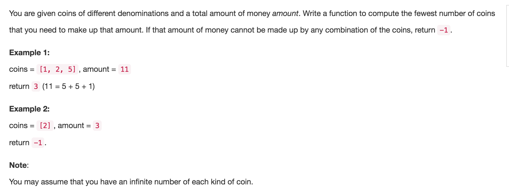

# Coin Change

思路

* dp\[i\]表示达到i面额需要的最少硬币数，初始化为无限大
* 要么不用当前硬币，要么用到当前硬币，比较哪个需要的硬币少
* dp\[i\] = min\(dp\[i\], dp\[i - coins\[j\]\] + 1\)

时间复杂度 O\(amount \* coins.length\)   
空间复杂度 O\(amount\)

[Youtube讲解](https://www.youtube.com/watch?annotation_id=annotation_2195265949&feature=iv&src_vid=Y0ZqKpToTic&v=NJuKJ8sasGk)

```java
public class Solution {
    public int coinChange(int[] coins, int amount) {
        //dp[i]表示达到i面额需要的最少硬币数
        //dp[i] = min(dp[i], dp[i - coins[j]] + 1)

        if (coins == null || coins.length == 0) return -1;
        if (amount == 0) return 0;
        if (amount < 0) return -1;

        int[] dp = new int[amount + 1];

        for (int i = 1; i <= amount; i++) {
            dp[i] = Integer.MAX_VALUE;
        }

        for (int i = 1; i <= amount; i++) {
            for (int j = 0; j < coins.length; j++) {
                //硬币面值比需要的大
                if (coins[j] > i) continue;
                //去掉这块硬币，取不到值
                if (dp[i - coins[j]] == Integer.MAX_VALUE) continue;
                //表示要么不要这块硬币，要么用到这块硬币，看哪个值小取哪个
                dp[i] = Math.min(dp[i], dp[i - coins[j]] + 1);
            }
        }

        if (dp[amount] == Integer.MAX_VALUE) return -1;
        return dp[amount];
    }
}
```


