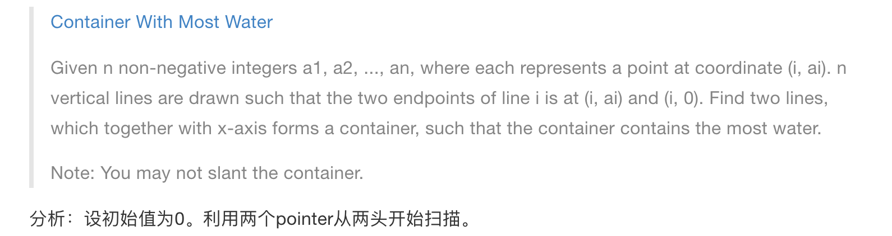
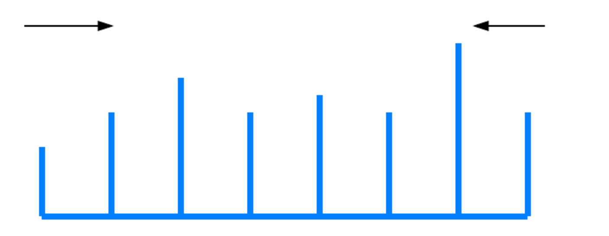

# Container With Most Water
tags:Two pointer,Test




典型双指针问题

* 注意短板理论: 
  * ```height[left] < height[right] left++``` 因为移动left可能变大，而移动right只会变小，因为left是短板，高固定死了,没法补救。反之亦然。
```java
public class Solution {
    public int maxArea(int[] height) {
        //谁小移谁
        //height[left] < height[right] left++ 因为移动left可能变大，而移动right只会变小，因为left是短板，高固定死了
        
        if (height == null || height.length == 0) return 0;
        int max = 0;
        int left = 0;
        int right = height.length - 1;
        
        while (left < right) {
            max = Math.max(max, (right - left) * Math.min(height[left], height[right]));
            if(height[left] < height[right]) {
                left++;
            } else if (height[left] == height[right]) {
                left++;
                right--;
            } else {
                right--;
            }
        }
        
        return max;
    }
}
```