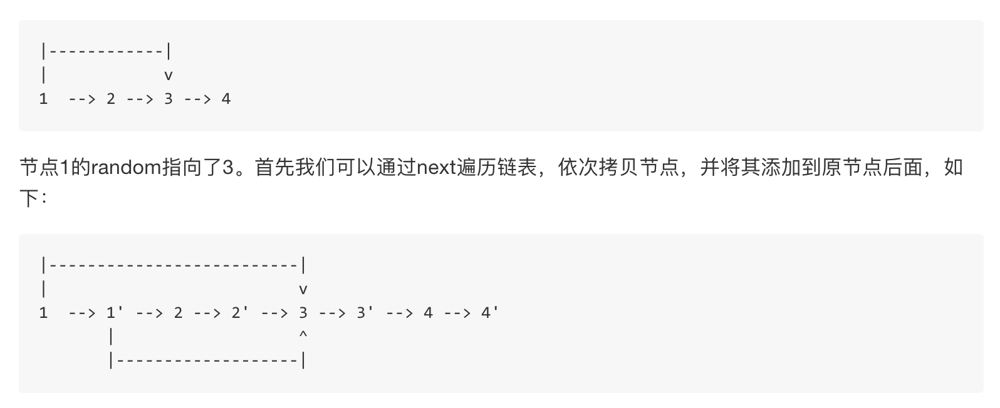

# Copy List with Random Pointer

http://www.lintcode.com/en/problem/copy-list-with-random-pointer/#


Hashmap O(n)时空

二刷
* Map处理映射关系，先copy链表元素再copy Random指针指向元素，每次copy前在map里判断是否已经生成，避免出现重复节点

```java
/**
 * Definition for singly-linked list with a random pointer.
 * class RandomListNode {
 *     int label;
 *     RandomListNode next, random;
 *     RandomListNode(int x) { this.label = x; }
 * };
 */
public class Solution {
    public RandomListNode copyRandomList(RandomListNode head) {
        if (head == null) return null;
        
        Map<RandomListNode, RandomListNode> map = new HashMap<>();
        RandomListNode dummy = new RandomListNode(0);
        RandomListNode curr = dummy;
        while (head != null) {
            RandomListNode newNode = null;
            if(map.containsKey(head)) {
                newNode = map.get(head);
            } else {
                newNode = new RandomListNode(head.label);
                map.put(head, newNode);
            }
            
            if (head.random != null) {
                if (map.containsKey(head.random)) {
                    newNode.random = map.get(head.random);
                } else {
                    newNode.random = new RandomListNode(head.random.label);
                    map.put(head.random, newNode.random);
                }
            }
            
            curr.next = newNode;
            curr = curr.next;
            head = head.next;
        }
        
        return dummy.next;
    }
}
```


用Hashmap 记录映射关系

```java
    public RandomListNode copyRandomList(RandomListNode head) {
        if (head == null) return null;
        
        HashMap<RandomListNode, RandomListNode> map = new HashMap<RandomListNode, RandomListNode>();
        
        RandomListNode dummy = new RandomListNode(0);
        RandomListNode pre = dummy;
        RandomListNode newNode = dummy;
        
        while (head != null) {
            if (map.get(head) != null) {
                newNode = map.get(head);
            } else {
                newNode = new RandomListNode(head.label);
                map.put(head, newNode);
            }
            
            //pre和newNode接上
            pre.next = newNode;
            
            
            if (head.random != null) {
                newNode.random = new RandomListNode(head.random.label);
                map.put(head.random, newNode.random);
            }
            
            pre = newNode;
            head = head.next;
        }
        
        return dummy.next;
    }
```


巧妙解法 O(1) 空间


```java
    private void copyNext(RandomListNode head) {

        while (head != null) {
            RandomListNode newHead = new RandomListNode(head.label);
            //因为我们只是简单的复制了random指针，所以新的节点的random指向的仍然是老的节点，譬如上面的1和1'都是指向的3。
            newHead.random = head.random;
            
            
            newHead.next = head.next;
            head.next =  newHead;
            head = head.next.next;
        }
    }
    
    private void copyRandom(RandomListNode head) {
        while (head != null) {
            if (head.next.random != null ) {
                //调整新的节点的random指针，对于上面例子来说，
               //我们需要将1'的random指向3'，其实也就是原先random指针的next节点
                head.next.random = head.random.next;
            }
            head = head.next.next;
        }
    }
    
    
    public RandomListNode copyRandomList(RandomListNode head) {
        if (head == null) return null;
        copyNext(head);
        copyRandom(head);
        
        return splitList(head);
    }
    
    public RandomListNode splitList(RandomListNode head) {
        RandomListNode newHead = head.next;
        while (head != null) {
            RandomListNode temp = head.next;
            head.next = temp.next;
            head = head.next;
            if (temp.next != null) {
                temp.next = temp.next.next;
            }
        }
        return newHead;
    }
```