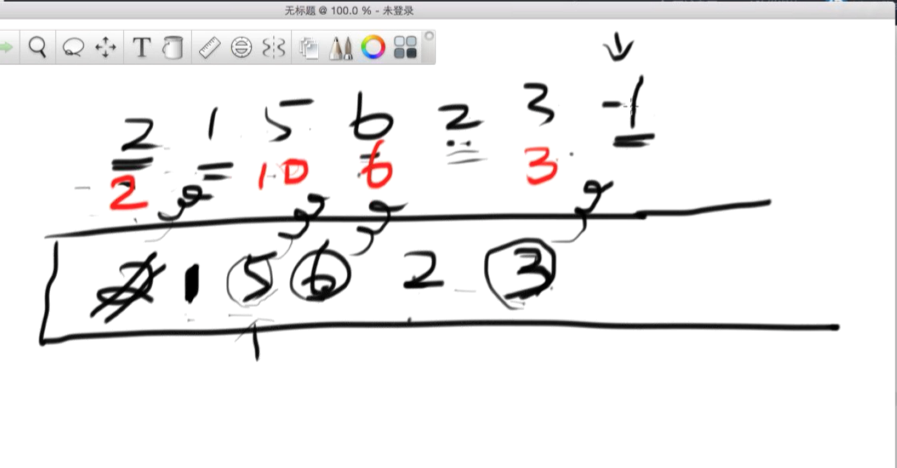

# 递增栈


Largest Rectangle in Histogram

http://www.lintcode.com/en/problem/largest-rectangle-in-histogram/

遍历全部高度， 找每个数左右第一个比他小的数在哪 


```java
    public int largestRectangleArea(int[] height) {

        if (height == null || height.length == 0) {
            return 0;
        }
        
        //维护一个递增栈
        Stack<Integer> stack = new Stack<Integer>();
        
        int max = 0;
        
        for (int i = 0; i <= height.length; i++) {
            int curt;
            if (i == height.length) {
                //最后用-1把栈清空
                curt = -1;
            } else {
                curt = height[i];
            }
            
            //当curt比递增栈最大值小
            while (!stack.isEmpty() && curt <= height[stack.peek()]) {
                int h = height[stack.pop()];
                int w;
                if (stack.isEmpty()) {
                    w = i;
                } else {
                    w = i - stack.peek() - 1;
                }
                
                max = Math.max(max, h * w);
            }
            stack.push(i);
        }
        
        return max;
    }
```

递减栈

http://www.jianshu.com/p/e05e598c8073