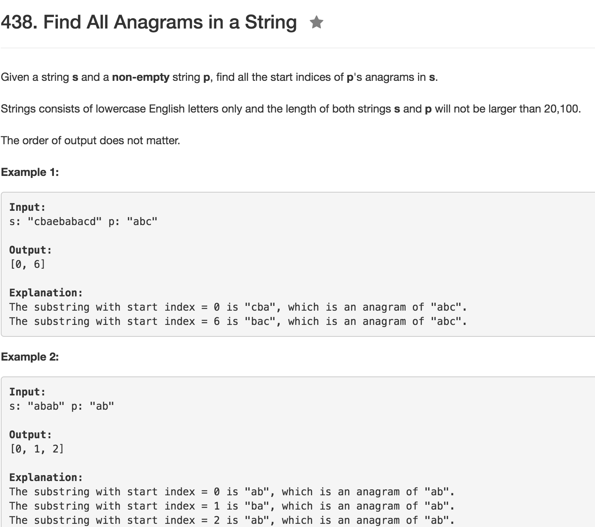

# Find all anagrams in a String
tags: anagrams



* 两个hash array
* 先构建好target array
* 然后用resource array来凑，每凑够target array长度的array时候比较一下，若相同加入result，然后把最开始的hash element抹去一个然后往后加入一个再比较，直到全比较完。
* 注意array比较不能 ```==```,要用```Arrays.equals```
```java
public class Solution {
    public List<Integer> findAnagrams(String s, String p) {
        List<Integer> res = new ArrayList<>();
        
        int[] h1 = new int[256];
        int[] h2 = new int[256];
        
        int m = s.length();
        int n = p.length();
        
        for (int i = 0; i < n; i++) {
            h2[p.charAt(i)]++;
        }
        
        for (int i = 0; i < m; i++) {
            h1[s.charAt(i)]++;
            if (i >= n) {
                h1[s.charAt(i - n)]--;
            }
            if (Arrays.equals(h1, h2)) res.add(i - n + 1);
        }
        
        return res;
    }
}
```