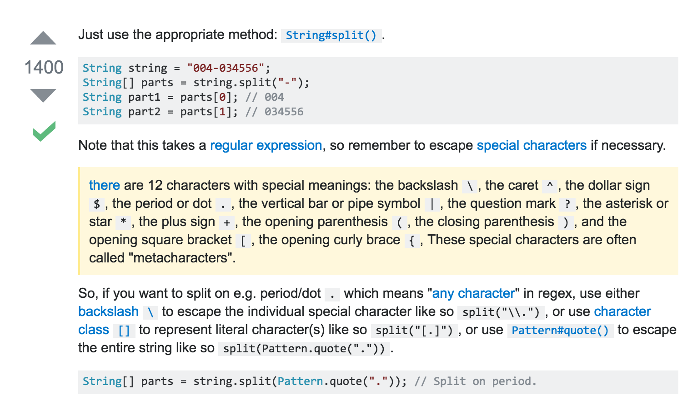

# FreeWheel

192.222.211.222

Valid or not

```java
case 1: null
case 2: >255 || <0
case 3: ***

失误部分：
1. case 4: 不足4位数 我忘了提了！！！

2. 不能用split(".")

   要用split("[.]")

3. try catch 才能parseInt
   
4. Regular Expression:
   !number.matches("[0-9]+")


```


```java
public class ValidIPV4 {
    public static boolean validate(String s) {
        if (s == null) return false;
        String[] numbers = s.trim().split("[.]");
        if (numbers.length != 4) return false;

        for (String number: numbers) {
            //Regular Expression: s.matches("[a-zA-Z]+")
            if (!number.matches("[0-9]+")) return false;
            
            
            try {
                int num = Integer.parseInt(number);
                if (num > 255 || num < 0) return false;
            } catch(NumberFormatException e) {
                return false;
            }
        }
        
        return true;
    }
    
    public static void main(String[] args) {
        System.out.println(validate("-192.144.22.aa"));
    }
}

```