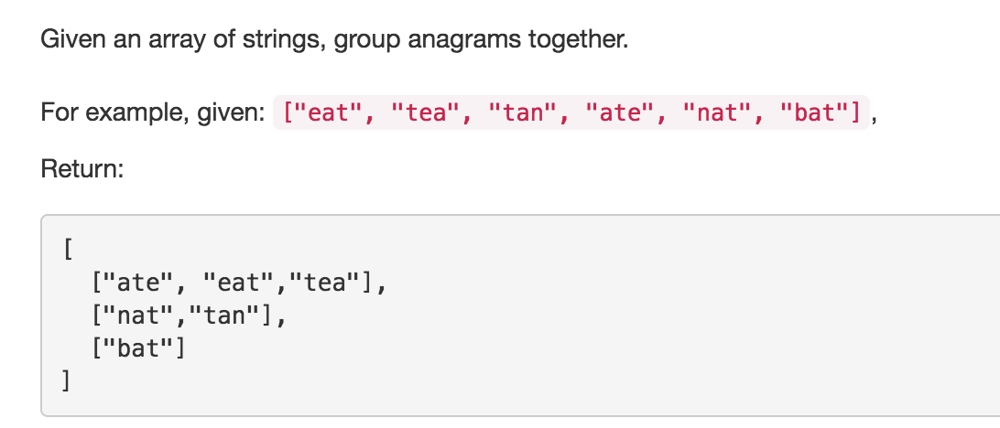

# Group Anagram
tags: anagrams

* Sort + HashMap. 根据sort后的string建key, 把sorted后一样的string都作为value.根据题设按字母顺序输出，最后还要sort一遍再加入result.
```java
public class Solution {
    public List<List<String>> groupAnagrams(String[] strs) {
        List<List<String>> res = new ArrayList<>();
        
        if (strs == null) return res;
        Map<String, List<String>> map = new HashMap<>();
        for (String str: strs) {
            char[] chars = str.toCharArray();
            Arrays.sort(chars);
            String sortedStr = String.valueOf(chars);
            if (map.containsKey(sortedStr)) {
                List<String> list = map.get(sortedStr);
                list.add(str);
            } else {
                List<String> list = new ArrayList<>();
                list.add(str);
                map.put(sortedStr, list);
            }
        }
        
        for (String s: map.keySet()) {
            List<String> list = map.get(s);
            Collections.sort(list);
            res.add(list);
        }
        
        return res;
    }
}
```