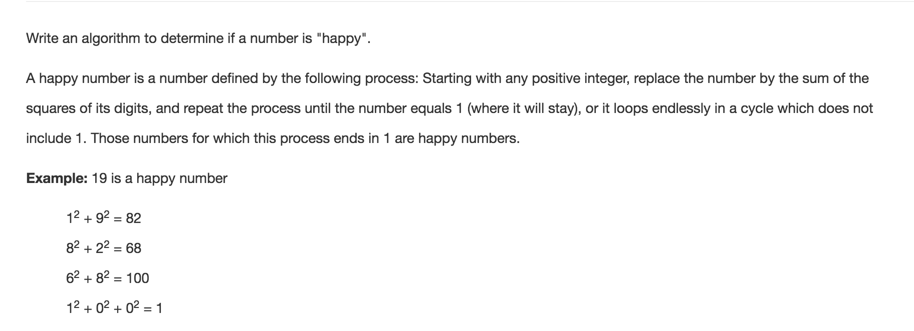

# Happy Number



* 用HashSet检查重复，如果有重复数字就会陷入死循环，这就不是Happy Number

```java
public class Solution {
    public boolean isHappy(int n) {
        if (n <= 0) return false;
        
        Set<Integer> set = new HashSet<>();
        
        while (n != 1) {
            if (set.contains(n)) return false;
            set.add(n);
            n = helper(n);
        }
        
        return true;
    }
    
    private int helper(int n) {
        int sum = 0;
        while (n != 0) {
            sum += (n % 10) * (n % 10);
            //进位
            n = n / 10;
        }
        
        return sum;
    }
}
```