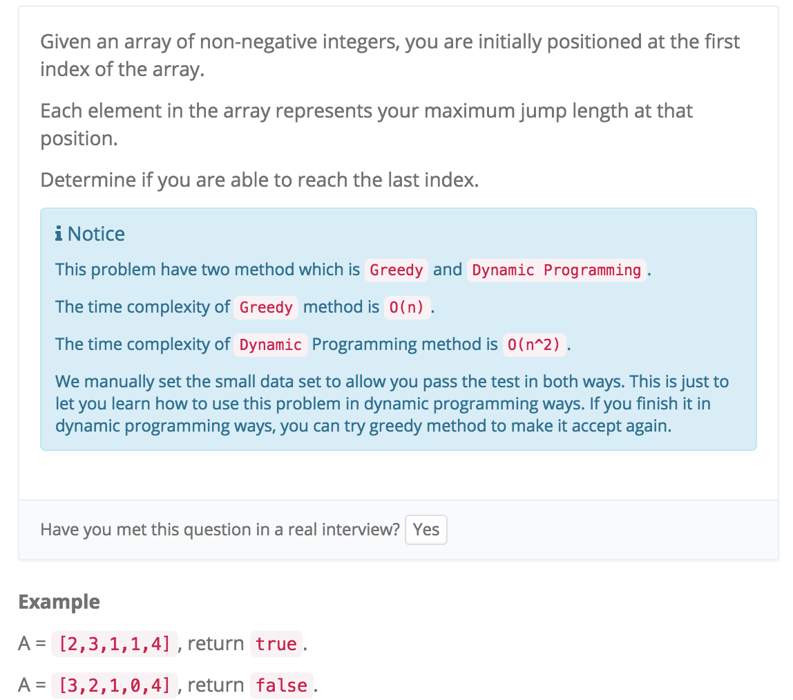

# Jump Games I II

http://www.lintcode.com/en/problem/jump-game/#



```java
public class Solution {
    /**
     * @param A: A list of integers
     * @return: The boolean answer
     */
    //State: f[i] 从起点跳到这个位置最少需要多少步
    //Function: f[i] = MIN(f[j]+1, j < i && j + A[j] >= i) 取出所有能从j到i中的最小值
    //Initialization: f[0] = 0，即一个元素时不需移位即可到达
    //Answer: f[n-1]
    
    
    public boolean canJump(int[] A) {
        boolean can[] = new boolean[A.length];
        can[0] = true;
        
        

        for(int i = 1; i < A.length; i++) {
            for (int j = 0; j < i; j++) {
                //j是true且从j能一步走到A[i]
                if(can[j] && j + A[j] >= i) {
                    can[i] = true;
                    //一旦走得到i 就break
                    break;
                }
            }
        }
        
        return can[A.length - 1];
    }
}
```


Jump Game II

http://www.lintcode.com/en/problem/jump-game-ii/

```java
public class Solution {
    /**
     * @param A: A list of lists of integers
     * @return: An integer
     */
    public int jump(int[] A) {
        //State: f[i] 从起点跳到这个位置最少需要多少步
        //Function: f[i] = MIN(f[j]+1, j < i && j + A[j] >= i) 取出所有能从j到i中的最小值
        //Initialization: f[0] = 0，即一个元素时不需移位即可到达
        //Answer: f[n-1]
        
        int[] steps = new int[A.length];
        
        steps[0] = 0;
        for (int i = 1; i < A.length; i++) {
            steps[i] = Integer.MAX_VALUE;
            for (int j = 0; j < i; j++) {
                if (steps[j] != Integer.MAX_VALUE && j + A[j] >= i) {
                    //可以一步跳到的所有方案的最小值
                    steps[i] = Math.min(steps[i], steps[j] + 1);

                }
            }
        }
        
        return steps[A.length - 1];
    }
}

```