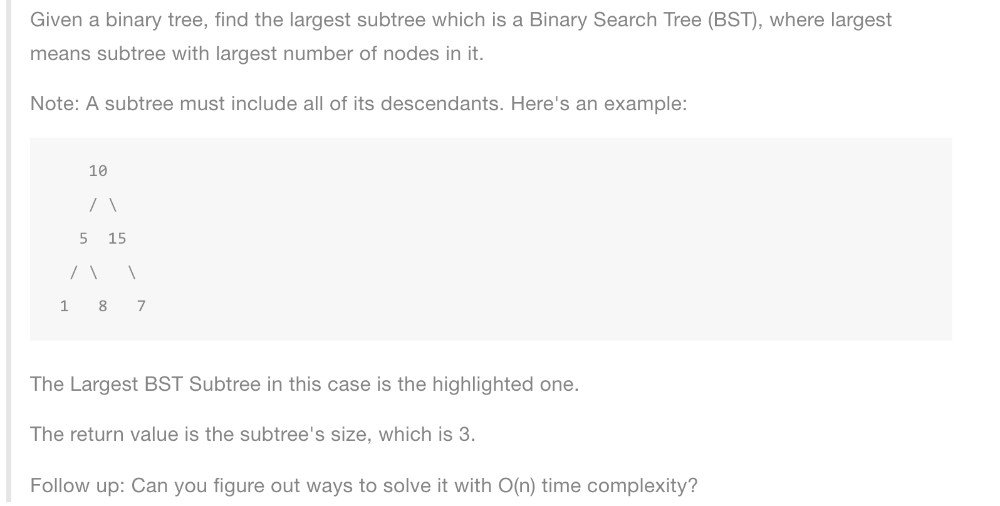

# Largest BST Subtree



非常好的一道题目，问题包含了三个block,求最大BST节点个数，求子树节点个数，和判断Valid BST.

递归求解，分为三种状态
1. 递归到了叶子节点，返回1
2. 遇到了valid bst,返回该tree节点个数（递归求解）
3. 本身不是valid bst,返回左右子树中最大的valid bst节点个数


### 时间复杂度：从下往上遍历整棵数，O(n)


```java
public int largestBST(TreeNode root) {
    if (root == null) return 0;

    if (root.left == null && root.right == null) return 1;

    if (isValid(root, Long.MAX_VALUE, Long.MIN_VALUE)) {
        return count(root);
    }

    return Math.max(largestBST(root.left), largestBST(root.right));
}

private boolean isValid(TreeNode root, long max, long min) {
    if (root == null) return true;

    if (root.val < min || root.val > max) return false;

    return isValid(root.left, root, min) && isValid(root.right, max, root);
}

private int count(TreeNode root) {
    if (root == null) return 0;

    if (root.left == null && root.right == null) return 1;

    return count(root.left) + count(root.right) + 1;
}
```