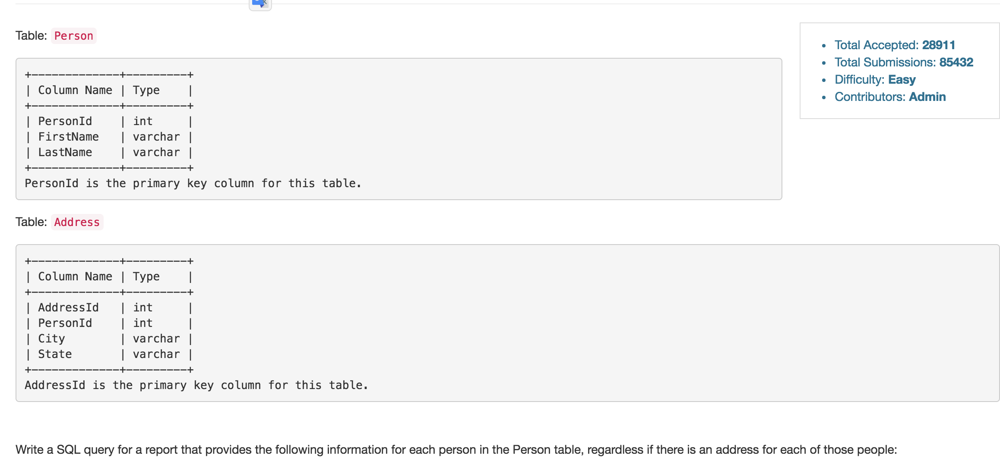

# 例题

*Combine Two Tables* [leet](https://leetcode.com/problems/combine-two-tables/)



* 需要用LEFT JOIN,因为可能有的员工没有Address，此时也要返回所有员工。

---

*Second Highest Salary*

```sql
Select (Select Distinct Salary From Employee Order By Salary DESC limit 1 offset 1) as SecondHighestSalary
```

* offset会把第一行的数据exclude掉，limit: x, 所以返回往下的x条数据。
* 第四高 ```limit 1 offset 3```
* 在外围再放一个Select 可以在没有第二高的时候输出Null

---
*Delete Duplicate Email*
```sql
Delete p2 from Person as p1
join Person as p2 ON p1.Email = p2.Email
Where p2.Id >p1.Id;
```
