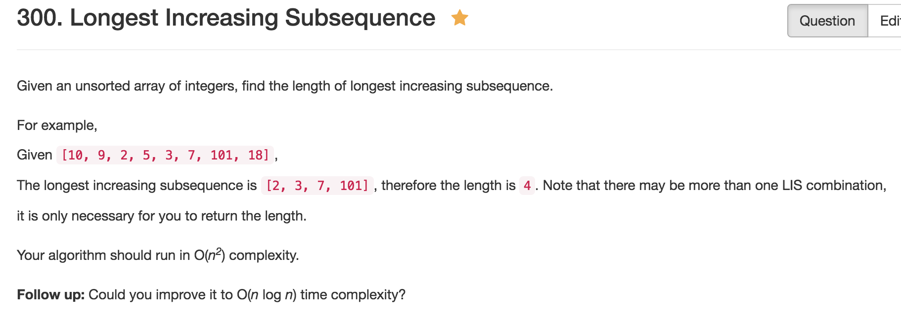

# Longest Increasing Subsequence


二刷：
* 初始化长度应该为num array的长度，因为要看前i个数第i个数结尾的lis,这样dp[i]能和nums[i]对应

---
* dp[i]代表前i个数字中以第i个数结尾的lis

  这里如果dp[i]代表i长度array最长的lis,就没法写状态转移方程了，发现没法直接取得最大值，所以要转个弯，从每个数字入手
* nums[j] < nums[i] dp[i] = max(dp[j]) + 1
* 最后对dp[i]逐个比较，取得最大值
    
```java
public class Solution {
    public int lengthOfLIS(int[] nums) {
        if (nums == null || nums.length == 0) return 0;
        
        int[] dp = new int[nums.length];
        Arrays.fill(dp, 1);
        for (int i = 1; i < nums.length; i++) {
            for (int j = 0; j < i; j++) {
                if (nums[j] < nums[i]) {
                    dp[i] = Math.max(dp[i], dp[j] + 1);
                }
            }
        }
        int max = 0;
        for (int lis: dp) {
            max = Math.max(max, lis);
        }
        
        return max;
    }
}
```