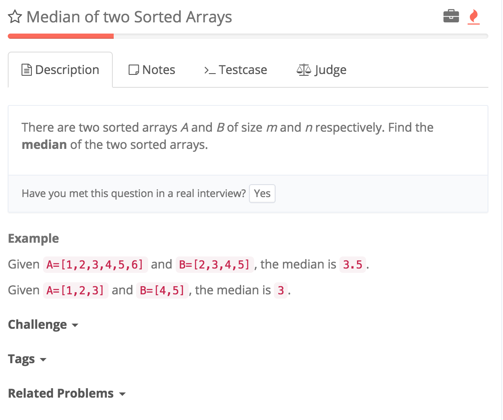

# Median of Two Sorted Arrays

http://www.lintcode.com/en/problem/median-of-two-sorted-arrays/



时间复杂度：
log(m + n / 2) log(k)

http://blog.csdn.net/yutianzuijin/article/details/11499917
```
    //log(m + n / 2)
    //换成找到第k个点思考
    public double findMedianSortedArrays(int[] A, int[] B) {
        int length = A.length + B.length;
        if (length % 2 == 1) {
            return findKth(A, 0, B, 0, length / 2 + 1);
        } else {
            //这里要除以2.0来变成double!
            return (findKth(A, 0, B, 0, length / 2) + findKth (A, 0, B, 0, length / 2 + 1)) / 2.0;
        }
        

    }
    
    private int findKth(int[] A, int A_start, int[] B, int B_start, int k) {
        //A全舍弃了 找B的第k个点
        if (A_start >= A.length) {
            return B[B_start + k - 1];
        }
        
        
        //B全舍弃了 找A的第k点
        if (B_start >= B.length) {
            return A[A_start + k - 1];
        }
        
        //return 条件 找第一个点
        if (k == 1) {
            return Math.min(A[A_start], B[B_start]);
        }
        
        int A_key = 0;
        int B_key = 0;
        
        //找到A的k / 2点
        if ((A_start + k / 2 - 1) < A.length) {
            A_key = A[A_start + k / 2 - 1];
        } else {
            //不舍弃A
            A_key = Integer.MAX_VALUE;
        }
        
        //找到B的k / 2点
        if ((B_start + k / 2 - 1) < B.length) {
            B_key = B[B_start + k / 2 - 1];
        } else {
            //不舍弃B
            B_key = Integer.MAX_VALUE;
        }
        

        如果A小于B，舍弃A的前半断,k缩短为k - k / 2
        if (A_key < B_key) {
            return findKth(A, A_start + k / 2, B, B_start, k - k / 2);
        } else {
            return findKth(A, A_start, B, B_start + k / 2, k - k / 2);
        }
    }
```