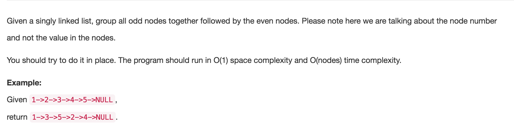

# Odd Even Linked List
tags:Two Pointer



两个指针来做，odd指向奇节点，even指向偶节点，然后把偶节点even后面的那个奇节点提前到odd的后面，偶节点的next也指向下下个节点, 然后odd和even各自前进一步，此时even又指向偶节点，odd指向当前奇节点的末尾，以此类推直至把所有的奇偶节点都连好，
* 最后要把奇节点和第一个偶节点连起来

```java
public class Solution {
    public ListNode oddEvenList(ListNode head) {
        if (head == null || head.next == null) return head;
        
        ListNode odd = head;
        ListNode even = head.next;
        //记录下第一个even的位置，最后连起来
        ListNode evenMark = even;
        
        while (even !=null && even.next != null) {// even 在后，故用其检测边界
           // 先做odd，后做 even，可使循环结束时odd不为null，方便连接最终的even list
            odd.next = even.next;
            even.next = even.next.next;
            
            odd = odd.next;
            even = even.next;
        }
        
        //odd和even要连起来
        odd.next = evenMark;
        
        return head;
    }
}
```