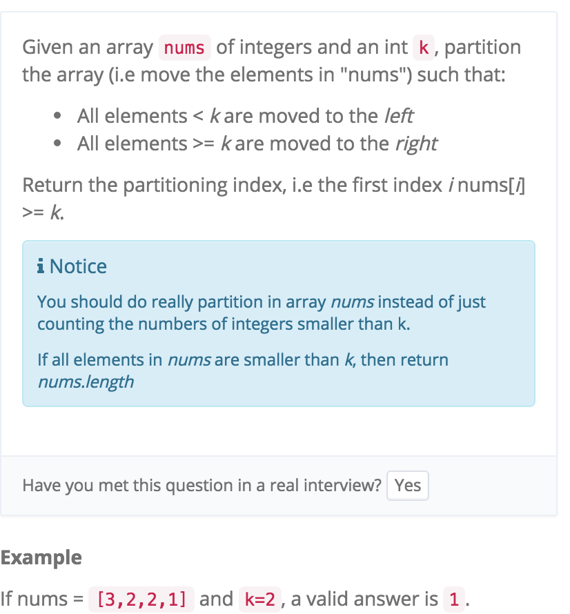

# Partition Array

http://www.lintcode.com/en/problem/partition-array/



Quick Sort的思想

左右两边一直移 直到移不动交换 碰到的时候就return 

```java
    public int partitionArray(int[] nums, int k) {
	    //write your code here
	    int size = nums.length;
	    
	    int left = 0;
	    int right = size - 1;
	    
	    while (left <= right) {
	        //左边一直走，直到比k大
	        while (left <= right && nums[left] < k) {
	            left++;
	        }
	        
	        //右边一直走，直到比k小
	        while (left <= right && nums[right] >= k) {
	            right--;
	        }
	        
	        if (left <= right) {
	            int tmp = nums[left];
	            nums[left] = nums[right];
	            nums[right] = tmp;
	            left++;
	            right--;
	        }
	    }
	    
	    //0 based , 所以return left就行
	    return left;
    }
```