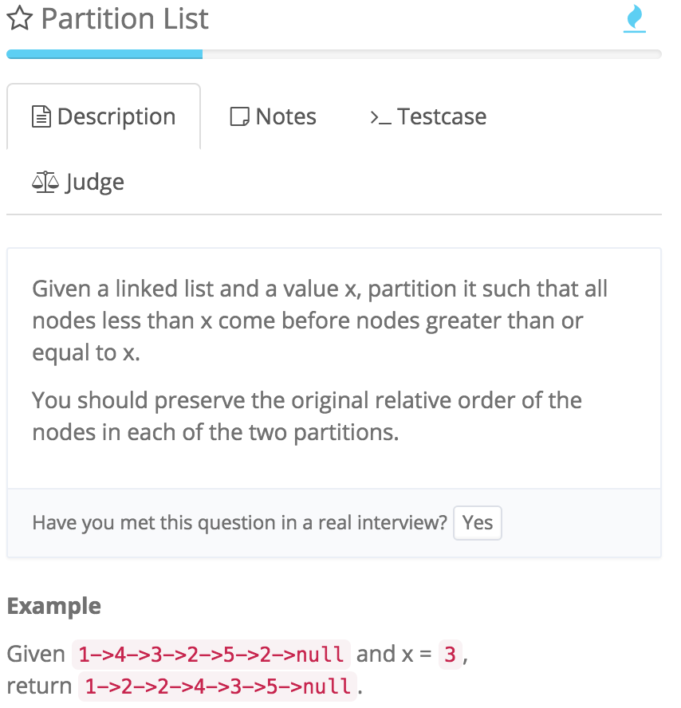

# Partition List

http://www.lintcode.com/en/problem/partition-list/




两个dummy node,小 大各一个，最后连上


```java
    public ListNode partition(ListNode head, int x) {
        //两个dummy node,小 大各一个，最后连上
        
        if (head == null || head.next == null) {
            return head;
        }
        
        ListNode dummySmall = new ListNode(0);
        ListNode dummyBig = new ListNode(0);
        
        ListNode small = dummySmall;
        ListNode big = dummyBig;
        
        while (head != null) {
            if (head.val < x) {
                small.next = head;
                //把head赋给left用来下次比较
                small = head;
            } else {
                big.next = head;
                big = head;
            }
            
            head = head.next;
        }
        
        small.next = dummyBig.next;
        
        //注意把尾巴结束掉，不然可能形成circle
        big.next = null;
        
        return dummySmall.next;
    }
```