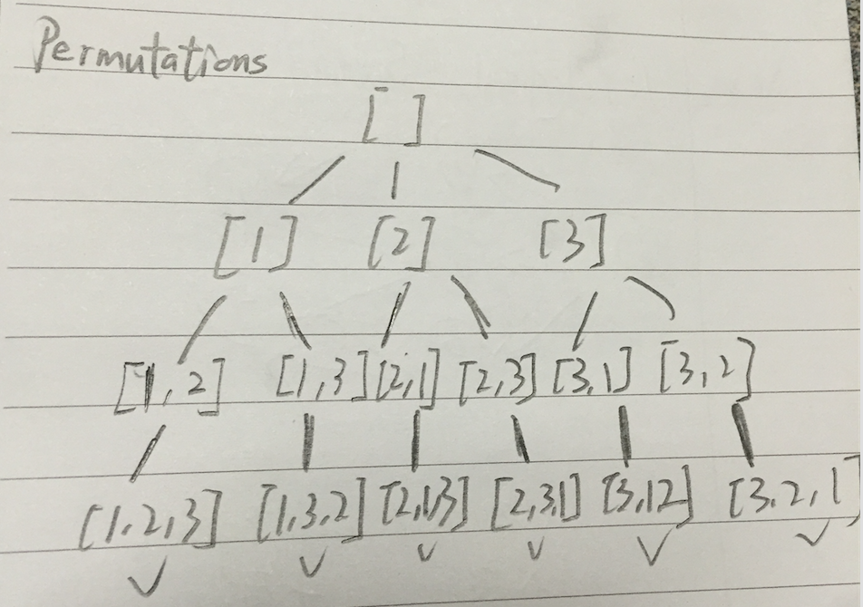

# Permutation BFS

http://www.lintcode.com/en/problem/permutations/



把1开头的list全加进去，然后remove[1],把2开头的list加进去，以此类推


results.add(new ArrayList<Integer>(list))

http://www.jiuzhang.com/qa/663/

```java
    public List<List<Integer>> permute(int[] nums) {
        ArrayList<List<Integer>> res = new ArrayList<List<Integer>>();
        
        
        if (nums == null) {
            return res;
        }
        
        if (nums.length == 0) {
            res.add(new ArrayList<Integer>());
            return res;
        }
        
        ArrayList<Integer> list = new ArrayList<Integer>();
        
        helper(res, list, nums);
        
        return res;
    }
    
    private void helper(ArrayList<List<Integer>> res, ArrayList<Integer> list, int[] nums) {
        //base case
        if (list.size() == nums.length) {
            
            //注意这里要new新的 否则只add了reference
            res.add(new ArrayList<Integer>(list));
            return;
        }
        
        for (int i = 0; i < nums.length; i++) {
            //不要重复加
            if (list.contains(nums[i])) {
                continue;
            }
            
            list.add(nums[i]);
            helper(res, list, nums);
            
            //往回走
            list.remove(list.size() - 1);
        }
    }
```

Related Problem

Subsets

```java
    public ArrayList<ArrayList<Integer>> subsets(int[] nums) {
        // write your code here
        if (nums == null || nums.length == 0) {
            return null;
        }
        
        ArrayList<ArrayList<Integer>> result = new ArrayList<ArrayList<Integer>>();
        ArrayList<Integer> list = new ArrayList<Integer>();
        Arrays.sort(nums);
        subsetsHelper(result, list, nums, 0);
        
        return result;
    }
    
    public void subsetsHelper(ArrayList<ArrayList<Integer>> result, ArrayList<Integer> list, int[] nums, int pos) {
        result.add(new ArrayList<Integer>(list));
        
        for (int i = pos; i < nums.length; i++) {
            list.add(nums[i]);
            subsetsHelper(result, list, nums, i + 1);
            //回溯
            list.remove(list.size() - 1);
        }
    }
```

 Permutations II
 
 ```java
 /*
            上面的判断主要是为了去除重复元素影响。
            比如，给出一个排好序的数组，[1,2,2]，那么第一个2和第二2如果在结果中互换位置，
            我们也认为是同一种方案，所以我们强制要求相同的数字，原来排在前面的，在结果
            当中也应该排在前面，这样就保证了唯一性。所以当前面的2还没有使用的时候，就
            不应该让后面的2使用。
            */
 if (visited[i] == 1 || (i != 0 && nums[i - 1] == nums[i] && visited[i -1] == 0)) {
                continue;
            }
 ```
 
  Subsets II

```java
            //跳过相邻两个相等的数
            if (i != pos && S.get(i - 1) == S.get(i)) {
                continue;
            }
```