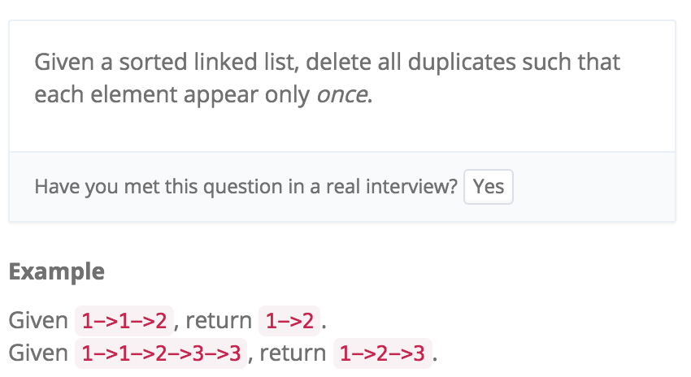
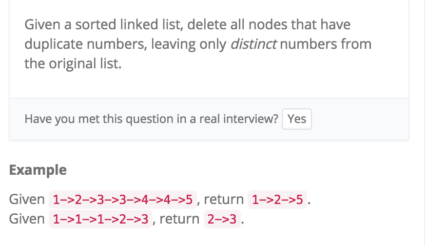

# Remove Duplicates from Sorted List I II



```java
    public static ListNode deleteDuplicates(ListNode head) { 
        // write your code here
        if (head == null || head.next == null) {
            return head;
        }
        //不动头结点，直接就node = head操作
        ListNode node = head;
        
        while (node.next != null) {
            if (node.val == node.next.val) {
                node.next = node.next.next;
            } else {
                node = node.next;
            }
        }
        
        return head;
    }
```

 Remove Duplicates from Sorted List II


头结点可能改变 需要Dummy Node

先把value存起来 然后删掉后才可继续比较
```java
public static ListNode deleteDuplicates(ListNode head) {
        // write your code here
        if (head == null || head.next == null) {
            return head;
        }
        
        ListNode dummy = new ListNode(0);
        dummy.next = head;
        head = dummy;
        
        while (head.next != null && head.next.next != null) {
            if (head.next.val == head.next.next.val) {
                
                //先把value存起来 然后删掉后才可继续比较
                int val = head.next.val;
                while (head.next != null && head.next.val == val) {
                    head.next = head.next.next;
                }
            } else {
                head = head.next;
            }
        }
        
        return dummy.next;
    }
```