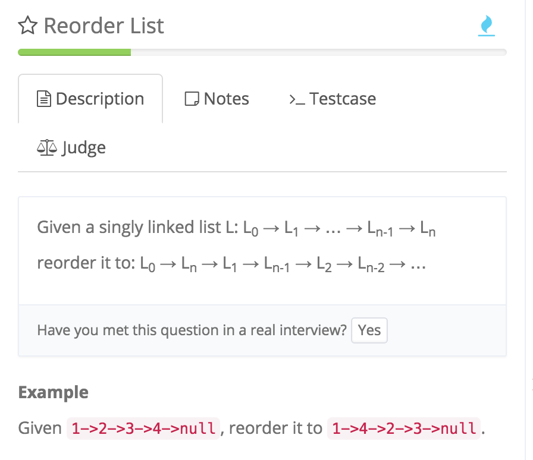

# Reorder List (reverse+findMid+Merge)

http://www.lintcode.com/en/problem/reorder-list/#



```java
//先把list一切二，后面的翻转，再两两配对
        public ListNode reverse(ListNode node) {
            ListNode prev = null;
            while (node != null) {
                ListNode temp = node.next;
                node.next = prev;
                prev = node;
                node = temp;
            }
            return prev;
        }
        
        public ListNode getMid(ListNode node) {
            ListNode slow = node;
            ListNode fast = node;
            
            while (fast.next != null && fast.next.next != null) {
                slow = slow.next;
                fast = fast.next.next;
            }
            
            return slow;
            
        }
        
        public void merge(ListNode head1, ListNode head2) {
            int index = 0;
            
            ListNode dummy = new ListNode(0);
            while (head1 != null && head2 != null) {
                if (index % 2 == 0) {
                    dummy.next = head1;
                    head1 = head1.next;
                } else {
                    dummy.next = head2;
                    head2 = head2.next;
                }
                
                dummy = dummy.next;
                index++;
            }
            
            
            //注意head1和head2可能没分完
            if (head1 != null) {
                dummy.next = head1;
            }
            
            if (head2 != null) {
                dummy.next = head2;
            }
        }
        
        public void reorderList(ListNode head) {  
            if (head == null || head.next == null) {
                return;
            }
        
            ListNode mid = getMid(head);
            ListNode tail = reverse(mid.next);
            
            //*****断开才能merge
            mid.next = null;
            
            merge(head, tail);
        }
```