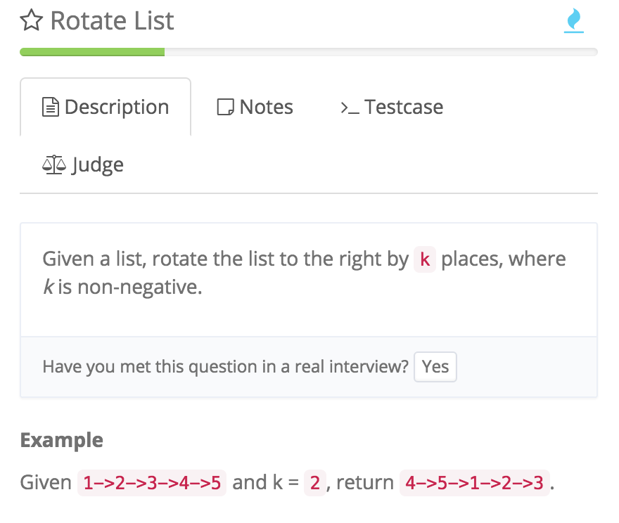

# Rotate List\(快慢指针）

[http://www.lintcode.com/en/problem/rotate-list/\#](http://www.lintcode.com/en/problem/rotate-list/#)

  
二刷

使用fast和slow ListNode

坑：先把fast和head连起来，如果先连head = slow.next，slow.next可能为null\(0-&gt;1-&gt;null\)

```java
public class Solution {
    /**
     * @param head: the List
     * @param k: rotate to the right k places
     * @return: the list after rotation
     */
    public ListNode rotateRight(ListNode head, int k) {
        // write your code here
        if (head == null || head.next == null) return head;

        int length = getLength(head);

        int steps = k % length;

        ListNode fast = head;
        ListNode slow = head;

        while (steps > 0) {
            fast = fast.next;
            steps--;
        }

        while (fast.next != null) {
            slow = slow.next;
            fast = fast.next;
        }

        //!注意 先把尾巴和头连起来，否则head可能为null!!!
        fast.next = head;
        head = slow.next;
        slow.next = null;
        
        return head;
    }
```

快慢指针 快指针先走k % length步，慢指针开始走， 最后把该连的连， 该断的断

```java
public class Solution {
    /**
     * @param head: the List
     * @param k: rotate to the right k places
     * @return: the list after rotation
     */

    private int getLength(ListNode head) {
        int length = 0;
        while (head != null) {
            length++;
            head = head.next;
        }
        return length;
    }


    public ListNode rotateRight(ListNode head, int k) {

        if (head == null || head.next == null) {
            return head;
        }

        int length = getLength(head);

        int n = k % length;

        ListNode dummy = new ListNode(0);
        dummy.next = head;
        head = dummy;
        ListNode tail = dummy;

        //head先走n步
        for (int i = 0; i < n; i++) {
            head = head.next;
        }

        //head和tail一起走
        while (head.next != null) {
            head = head.next;
            tail = tail.next;
        }

        //中间接上
        head.next = dummy.next;

        //作为头
        dummy.next = tail.next;

        //断开连接
        tail.next = null;

        return dummy.next;
    }

}
```


