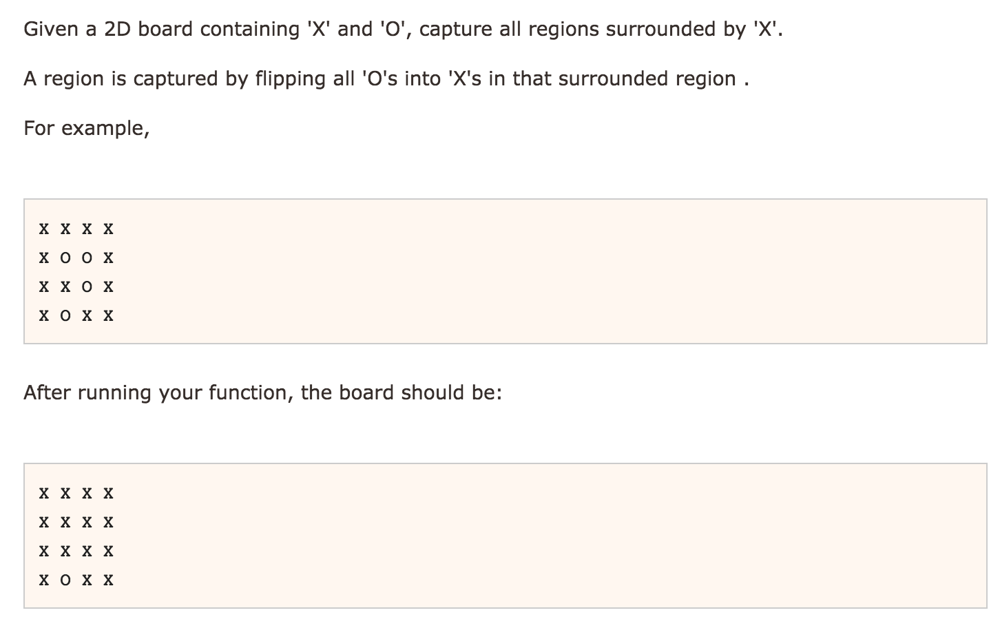

# Surrounded Regions DFS&BFS



DFS
* 发现四条边的O都不能翻牌，就找到这些O并对每个O DFS 找到所有领接的O,把这些O标记成Y
* 遍历矩阵 Y的变回O,还是O的就可以翻牌。

```java
public class Solution {
    public void solve(char[][] board) {
        if (board == null || board.length == 0 || board[0].length == 0) return;
        
        int m = board.length;
        int n = board[0].length;
        
        //first row, last row
        for (int i = 0; i < n; i++) {
            dfs(board, 0, i);
            dfs(board, m - 1, i);
        }
        
        //first col, last col, avoid four duplicate points
        for (int j = 1; j < m - 1; j++) {
            dfs(board, j, 0);
            dfs(board, j, n - 1);
        }
        
        for (int i = 0; i < m; i++) {
            for (int j = 0; j < n; j++) {
                if(board[i][j] == 'Y') {
                    board[i][j] = 'O';
                } else if (board[i][j] == 'O') {
                    board[i][j] = 'X';
                }
            }
        }
    }
    
    private void dfs(char[][] board, int x, int y) {
        if (x < 0 || x >= board.length || y < 0 || y >= board[0].length) return;
        if (board[x][y] != 'O') return;
        
        board[x][y] = 'Y';
        
        dfs(board, x + 1, y);
        dfs(board, x - 1, y);
        dfs(board, x, y + 1);
        dfs(board, x, y - 1);
    }
}
```