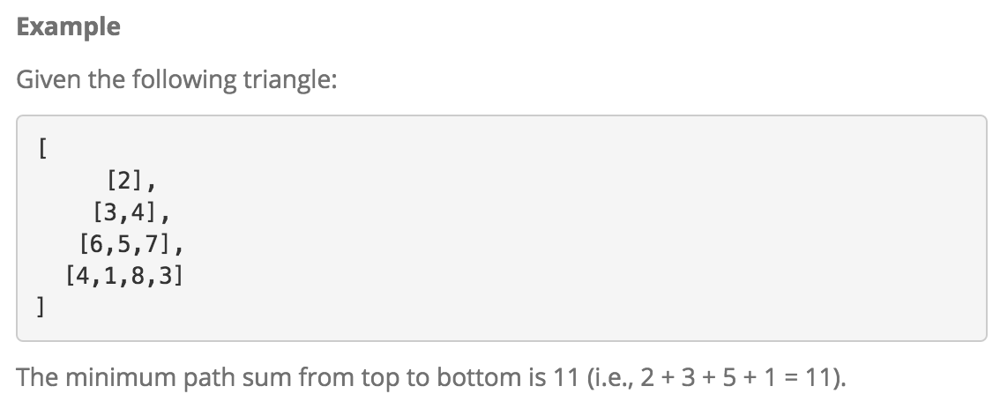

# Triangle

http://www.lintcode.com/en/problem/triangle/



Related Problem

Minimum Path sum

http://www.lintcode.com/en/problem/minimum-path-sum/

遍历

```java
private int best = Integer.MAX_VALUE;
    private int n;
    
    public int minimumTotal(int[][] triangle) {
        // 每一层有两种走法，一共有n层 O(2^n)
        this.n = triangle.length;
        traverse(0, 0, 0, triangle); 
        return best;
    }
    
    private void traverse(int x, int y, int sum, int[][] triangle) {
        if (x == n) {
            if (sum < best) {
                best = sum;
            }
            return;
        }
        
        traverse(x + 1, y, sum + triangle[x][y], triangle);
        traverse(x + 1, y + 1, sum + triangle[x][y], triangle);
        
    }
```

分治

```java
    public int minimumTotal(int[][] triangle) {
        int n = triangle.length;
        return dc(0, 0, triangle, n);
        
    }
    
    private int dc(int x, int y, int[][] A, int n) {
        if (x == n) {
            return 0;
        }
        
        return A[x][y] + Math.min(dc(x + 1, y, A, n), dc(x + 1, y + 1, A, n));
    }
```


动归 n^2
```java
    public int minimumTotal(int[][] triangle) {
        if (triangle == null || triangle.length == 0) {
            return -1;
        }
        
        // state: f[x][y] = minimum path value from 0,0 to x,y
        int n = triangle.length;
        int [][] f = new int[n][n];
        
        //initialize
        f[0][0] = triangle[0][0];
        for (int i = 1; i < n; i++) {
            f[i][0] = f[i - 1][0] + triangle[i][0];
            f[i][i] = f[i - 1][i - 1] + triangle [i][i];
        }
        
        //top down
        for (int i = 1; i < n; i++) {
            for (int j = 1; j < i; j++) {
                f[i][j] = Math.min(f[i - 1][j - 1], f[i - 1][j]) + triangle[i][j];
            }
        }
        
        // answer
        int best = f[n - 1][0];
        for (int i = 1; i < n; i++) {
            best = Math.min(best, f[n - 1][i]);
        }
        
        
        return best;
    }
```