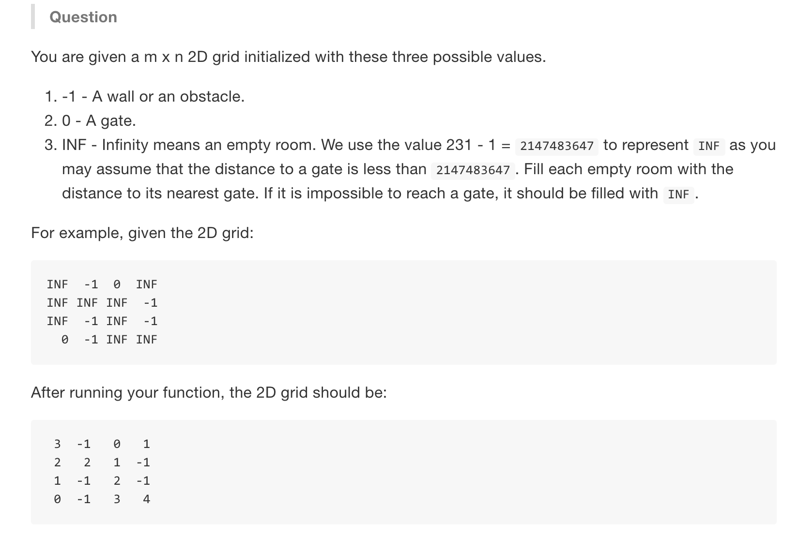

# Walls And Gates


分析
* 找到每个room的出门最短路径，想到BFS
* 先遍历矩阵找到门在哪，从门开始BFS
* 由于直接改变相应位置数字，不用判断是否visited


```java
public class wallandgates {
    public static void calculate(int[][] matrix) {
        if (matrix == null || matrix.length == 0) return;
        //矩阵BFS常用 把两个点打包成两位的数组
        //找到满足的位置开始bfs
        Queue<int[]> q = new LinkedList<>();
        for (int i = 0; i < matrix.length; i++) {
            for (int j = 0; j < matrix[0].length; j++) {
                if (matrix[i][j] == 0) {
                    int[] res = {i, j};
                    q.offer(res);
                }
            }
        } 
        //矩阵BFS常用，四种方向的dict二维矩阵
        //直接改了位置上的数值，所以不用判断是否visited
        int[][] dict = {{-1,1,0,0},{0,0,-1,1}};

        while (!q.isEmpty()) {
            int[] curr = q.poll();
            for (int i = 0; i < dict[0].length; i++) {
                int newR = curr[0] + dict[0][i];
                int newC = curr[1] + dict[1][i];
                if (newR < 0 || newR >= matrix.length || newC < 0 || newC >= matrix[0].length) continue;
                if (matrix[newR][newC] != Integer.MAX_VALUE) continue;
                matrix[newR][newC] = matrix[curr[0]][curr[1]] + 1;
                q.offer(new int[]{newR, newC});
             }
        }

        return;
    }

    public static void main(String[] args) {
        // 0是gate -1是障碍，room到0的最短距离
        int room = Integer.MAX_VALUE;
        int[][] matrix = {{room,-1,0,room},{room,room,room,-1},{room,-1,room,-1},{0,-1,room,room}};
        calculate(matrix);
        for(int i = 0; i < matrix.length; i++) {
            System.out.println();
            for(int j = 0; j <matrix[0].length; j++) {
                System.out.print(matrix[i][j] + " ");
            }
        }
    }

}
```