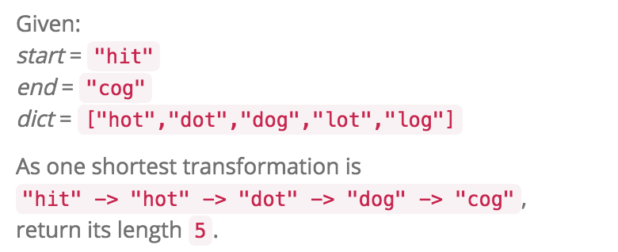

# WordLadder

http://www.lintcode.com/en/problem/word-ladder/#


---


三刷
* 可以用个map存每个单词到start word的最短距离信息, 同时map也可以完成去重工作
* 好处是不用for每一层来控制计算length
```java
    public int ladderLength(String beginWord, String endWord, Set<String> wordList) {
        if (wordList == null || wordList.size() == 0) return 0;
        
        wordList.add(endWord);
        
        Queue<String> q = new LinkedList<>();
        //map用来去重和存距离信息
        Map<String, Integer> map = new HashMap<>();
        q.offer(beginWord);
        map.put(beginWord, 1);
        while (!q.isEmpty()) {
            String curr = q.poll();
            int nextD = map.get(curr) + 1;
            for (String nextWord: getNextWords(curr, wordList)) {
                if (map.containsKey(nextWord)) continue;
                if (nextWord.equals(endWord)) return nextD;
                
                q.offer(nextWord);
                map.put(nextWord, nextD);
            }
        }
        return 0;
    }
```
---

二刷
* 在getNextWords时候换字符时候跪了，内外循环搞反。还是写个helper函数清楚。
* 由于set一开始就加入了start word,所以getNextWords时候可以不用判断和start word相同String的情况


# **时间复杂度**：

对于每个节点构图需要的时间复杂度是O(26*L)，BFS不重复地至多走过n个节点，故算法复杂度O(26*L*n)


```java
public int ladderLength(String start, String end, Set<String> dict) {
        // BFS
        if (dict == null) {
            return 0;
        }
        
        if (start.equals(end)) {
            return 1;
        }
        
        
        //注意先把end 加入dict 才可能get到end word
        dict.add(end);
        
        
        HashSet<String> set = new HashSet<String>();
        Queue<String> q = new LinkedList<String>();
        
        //加入start word
        set.add(start);
        q.offer(start);
        
        int length = 1;
        while (!q.isEmpty()) {
            length++;
            
            //****与clone graph类比 由于求最短路径 需要分层遍历 多一层循环
            int size = q.size();
            for (int i = 0; i < size; i++) {
                String curr = q.poll();
                for (String nextWord: getNextWord(curr, dict)) {
                    if (set.contains(nextWord)) {
                        continue;
                    }
                    
                    if (nextWord.equals(end)) {
                        return length;
                    }
                    
                    q.offer(nextWord);
                    set.add(nextWord);
                }
            }
        }
        
        return 0;
    }
    
    private String replace(String word, int index, char c) {
        //用一个char array
        char[] wordChar = word.toCharArray();
        wordChar[index] = c;
        return new String(wordChar);
    }
    
    private ArrayList<String> getNextWord(String word, Set<String> dict) {
        ArrayList<String> res = new ArrayList<String>();
        
        //两层循环换字母
        for (char c = 'a'; c <= 'z'; c++) {
            for (int i = 0; i < word.length(); i++) {
                if (word.charAt(i) == c) {
                    continue;
                }
                
                String newWord = replace(word, i, c);
                
                if (dict.contains(newWord)) {
                    res.add(newWord);
                }
            
            }
        }
        
        return res;
        
    }

```


Related

Word Ladder ii

http://www.lintcode.com/en/problem/word-ladder-ii/#

BFS+DFS

BFS: Trace every node's distance from the start node (level by level).

```java

HashMap<String, ArrayList<String>> nextWords = new HashMap<String, ArrayList<String>>();// Neighbors for every node
HashMap<String, Integer> distance = new HashMap<String, Integer>();// Distance of every node from the start node
```
distance map 存到Start的最短距离
nextwords map 存一个词的所有neighbors

DFS: output all paths with the shortest distance.


```java
public class Solution {
    public List<List<String>> findLadders(String start, String end, Set<String> dict) { 
        HashMap<String, Integer> distance = new HashMap<String, Integer>();
        HashMap<String, ArrayList<String>> neighbors = new HashMap<String, ArrayList<String>>();
        
        dict.add(start);
        dict.add(end);
        
        
        
        ArrayList<String> solution = new ArrayList<String>();
        List<List<String>> res = new ArrayList<List<String>>();
        
        bfs(start, end, dict, distance, neighbors);
        dfs(start, end, dict, distance, neighbors, solution, res);
        
        return res;
    }
    
    //get the distance of all nodes to start
    private void bfs(String start, String end, Set<String> dict, HashMap<String, Integer> distance, HashMap<String, ArrayList<String>> neighbors) {
        Queue<String> q = new LinkedList<String>();
        
        distance.put(start, 0);
        q.offer(start);
        
        while (!q.isEmpty()) {
            String word = q.poll();
            
            for (String nextWord: getNextWords(word, dict)) {
                if (!neighbors.containsKey(nextWord)) {
                    neighbors.put(nextWord, new ArrayList<String>());
                }
                
                neighbors.get(nextWord).add(word);
                
                //如果已经有nextWord的distance 就continue 从而保持最短距离
                if (distance.containsKey(nextWord)) {
                    continue;
                }
                
                distance.put(nextWord, distance.get(word) + 1);
                
                q.offer(nextWord);
            }
        }
        
    }
    
    private void dfs(String start, String end, Set<String> dict, HashMap<String, Integer> distance, HashMap<String, ArrayList<String>> neighbors, ArrayList<String> solution, List<List<String>> res) {
        solution.add(start);
        
        if (start.equals(end)) {
            res.add(new ArrayList<String>(solution));
        }
        
        
        if (!neighbors.containsKey(start)) {
            return;
        }
        
        
        for (String next: neighbors.get(start)) {
            if (distance.get(next) == distance.get(start) + 1) {
                dfs(next, end, dict, distance, neighbors, solution, res);
            }
        }
        solution.remove(solution.size() - 1);
    }
    
    // Find all next level nodes.    
     private static ArrayList<String> getNextWords(String word, Set<String> dict) {
         ArrayList<String> res = new ArrayList<String>();
         
         for (char c = 'a'; c <= 'z'; c++) {
             for (int i = 0; i < word.length(); i++) {
                 String newWord = replace(word, i, c);
                 if (word.charAt(i) == c) {
                     continue;
                 }
                 
                 if (dict.contains(newWord)) {
                     res.add(newWord);
                 }
             }
         }
         
         return res;
     }

     private static String replace(String word, int index, char c) {
         char[] wordChar = word.toCharArray();
         wordChar[index] = c;
         return new String(wordChar);
     }
}
```